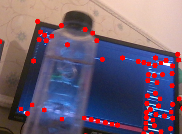

<h1> Bottle Detection using Pillow in Python at IMSAR</h1>
 
<h2>Features</h2>
<ul>
    <li>grab_bottles_images.py: detect bottle edges with haarcascade_upperbody.xml model, output: calib_images</li>
    <li>main_live.py: detect live bottle point edges based on calib_images, output: output_images + keypoints</li>
    <li>deep_learning.ipynb: CNN arhitecture model training, prediction for calib_images, accuracy: 1.0</li>
</ul>

<h2>Acknowledgments</h2>

<b> Python3: http://bit.ly/python3-certifications </b>
 
<b> Machine Learning: https://bit.ly/machine-learning-certification <b>
 

<h2>Photo</h2>

 
<h2>Contact</h2>

<b> Email: mariusc0023@gmail.com </b>
